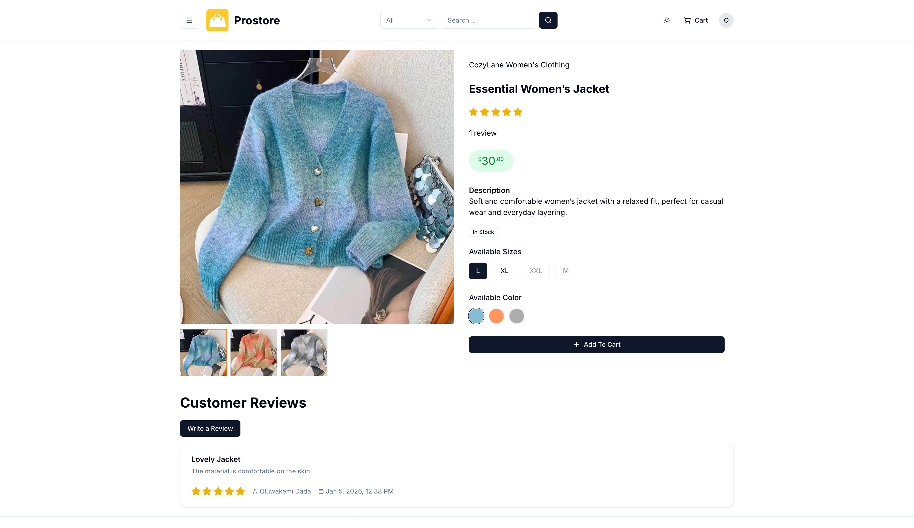

# Ecommerce Platform (Next.js)

A production-oriented ecommerce application built with **Next.js** and **TypeScript**, supporting multiple payment methods, role-based access control, and a dedicated admin dashboard. The project is designed with scalability, maintainability, and real-world ecommerce workflows in mind.

## Demo

<a href="https://next-prostore-app.vercel.app" target="_blank" rel="noopener noreferrer">Live Demo</a>




## Features

### Customer

- Product catalog with variants (size, color)
- Session based guest shopping cart
- Search, filtering, sorting, and pagination
- Checkout with PayPal, card payments, and Cash on Delivery
- Order creation and order status tracking
- Product review and rating

### Authentication & Authorization

- Secure authentication
- Role-based access control (user, admin)
- Protected routes and server-side authorization

### Admin

- Admin-only dashboard
- Inventory control
- Product and variant management
- Order management
- User management

## Tech Stack

- Next.js
- React
- Zod, TypeScript
- Stripe, PayPal
- Shadcn UI

## Getting Started

### Prerequisites

- Node.js (v18 or later)
- npm, yarn, or pnpm

### Installation

1. Clone the repository:

   ```bash
   git clone https://github.com/oluwakemi-dada/next-ecommerce.git
   cd next-ecommerce
   ```

2. Install dependencies:

   ```bash
   npm install
   ```

3. Environment Variables

   ```bash
   cp example.env .env
   ```

### Running the App

#### Development

```bash
npm run dev
```

The application will be available at:

```arduino
http://localhost:3000
```

#### Production

```bash
npm run build
npm run start
```
